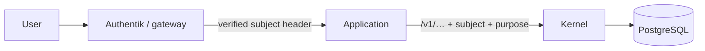

# The authorisation model

The kernel does not authenticate anyone. It trusts a verified subject supplied
by the gateway, and everything else follows from that.

## Three things a request carries

| | What it is | Missing → |
|---|---|---|
| **Verified subject** | The party id the gateway authenticated | 401 `no_verified_subject` |
| **Purpose** | `?purpose=credit_assessment` | 400 `purpose_required` |
| **Dataset** | `x-clycites-dataset: seed` for seed writes | seed write refused |

Purpose is a **query parameter**, not a header. A purpose is part of what is
being asked, not of how the request is transported. Sending it as
`x-clycites-purpose` returns 400 with a message saying so, rather than being
silently ignored and surfacing later as an inexplicable refusal.

## Four ways a read is permitted

1. **Self read** — you are a data subject of the record.
2. **Asserter read** — you asserted it.
3. **Member body** — a cooperative reading records of its own members, within
   limits.
4. **Third party with a grant** — a live grant from the subject, covering this
   purpose and this record type.

Everything else is refused with a bare 404. See
[Lawful basis and consent](../concepts/lawful-basis.md) for the full reason
list.

## What the gateway must do

!!! warning "The trust boundary is here, and it is a header"

    `verifiedSubject()` trusts a header set by the gateway. If that header can
    be set by a caller, every consent control in the kernel is bypassed.

    The kernel cannot defend this by itself. **The gateway must strip the header
    from inbound requests and set it only from an authenticated session.**

    This is listed on [What is not yet true](../compliance/not-yet-true.md).
    There has been no penetration test of this boundary.

## Delegation

An application acting for a party sends `on_behalf_of` plus a `delegation` id.
The kernel verifies the delegation was **live at `occurred_at`** — not now.

Delegation basis travels with everything asserted under it. Records made under
`organisational_bylaw` carry `delegated_by_organisational_bylaw` for life,
because a cooperative's own rules are a weaker mandate than an individual's
signature and a lender should be able to see which they are reading.

!!! note "Open decision D7"

    Whether delegation scope should be per record type or per field is
    unresolved. Confirmation is the live instance: a mandate to confirm
    deliveries is narrower than a mandate to assert them.

    `/metrics` carries two series intended to answer this empirically rather
    than by argument.

## OAuth clients and acting-for

A client has its own scope ceiling. A party authorisation can only narrow that
ceiling; it can never add a scope. `x-acting-for` changes the represented party
only after the kernel resolves an active authorisation for that exact client,
party, scope, and time.

Sandbox clients are a separate structural case. Their client row has a `seed`
dataset ceiling, they cannot receive a party authorisation, and every request
resolves to `seed` even if it asks for `live`. They may browse the fabricated
corpus without personal-data consent because no person described there exists.

## Rate limiting

Only the registry is rate limited, because it is the only unauthenticated
surface. That counter lives in one process, which makes it **per replica** and
no substitute for a limit at the gateway.

## What the kernel does not do

- Authenticate. Authentik does that.
- Issue tokens, sessions or API keys.
- Model roles. There is no `admin`. Authority comes from being a party to a
  record, from a delegation, or from a grant.
