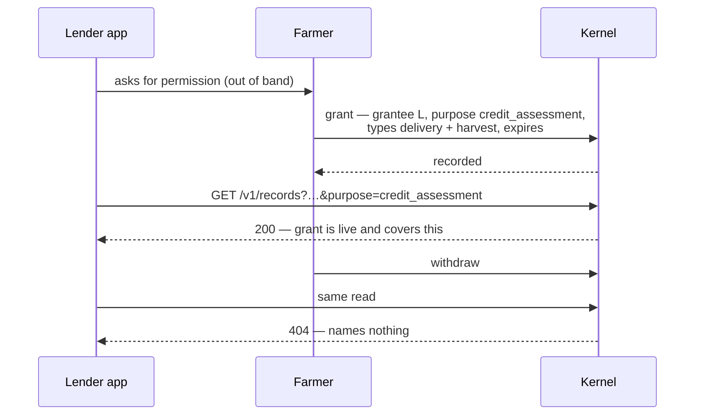

# Obtaining a grant

A grant is the data subject's permission for a named party to read named record
types for a named purpose. Without one, a third party sees a 404.

## What a grant names

| | Example | Why it is not optional |
|---|---|---|
| Subject | the farmer | Only a data subject can grant |
| Grantee | the lender | A grant to "anyone" is not consent |
| Purpose | `credit_assessment` | Consent is purpose-bound; a grant for lending is not a grant for marketing |
| Record types | `delivery`, `harvest` | A grant to read deliveries is not a grant to read plots |
| Expiry | a date | Indefinite consent is not consent |

All five are required. A grant missing any of them would be a general
authorisation, which is what consent law exists to prevent.

## The shape of the exchange



The kernel records consent. **It does not obtain it.** Asking a farmer, in a
language she reads, in a setting where refusing is genuinely available, is the
application's job and the hard part.

## Withdrawal

Withdrawal is a further record; nothing is edited and nothing is deleted. A
withdrawn grant still exists, along with what it permitted while it was live —
because "did this lender have permission on 3 June" is a question that will be
asked after the fact.

After withdrawal the same read returns 404, identical to the read of a record
that was never granted. Nothing in the refusal reveals that a grant once
existed.

## Withdrawal is not objection

If your user presses something labelled "stop using my data", she almost
certainly means **withdrawal**. Objection under s.7(3) reaches only processing
done *without* asking her, so on consent-based records it correctly stops
nothing.

The kernel now says so and names the grants she could withdraw instead. An
application should offer the act that works rather than the one whose name
matches the button. See
[Subject access and objection](../flows/subject-access.md).

## Reading as the grantee

```text
GET /v1/records?type=delivery&subject=<farmer>&purpose=credit_assessment
```

The purpose must match the grant's purpose. A mismatch is
`grant_wrong_purpose` in the audit log and a 404 to you — deliberately
indistinguishable from having no grant at all.

If you are debugging and cannot tell why a read fails, the answer is in the
audit log and an operator can read it. That asymmetry is intentional: a caller
who could tell *why* they were refused could map who holds what by trying.

## What a grant does not do

- It does not survive an objection in scope.
- It does not extend to record types it did not name.
- It does not let you export in bulk. There is no export path —
  see [What you cannot do](cannot.md).
- It does not make the records true. A grant conveys permission to read, not a
  warranty about content; the [quality flags](../reference/quality-flags.md)
  are how the content describes itself.
