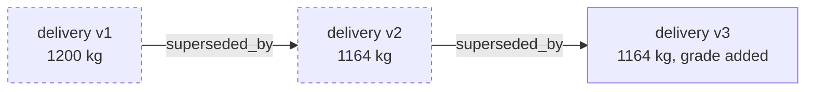

# Append-only and supersession

**What it prevents: a record that quietly became a different record, with
nobody able to tell.**

## The permission, not the policy

Append-only here is not a code review rule or an ORM setting. The application
role holds `INSERT` and `SELECT` on the record tables and nothing else:

```text
facts.record           INSERT, SELECT
inference.record       INSERT, SELECT
kernel.record_key      INSERT, SELECT
```

There is no `UPDATE` grant, so there is no privileged path by which a correction
could overwrite a record — not because the code refuses, but because the
database will not accept it. A developer under deadline pressure cannot work
around a permission that does not exist.

The dry run prints these grants at stage 1, together with **every** table where
the role does hold `UPDATE` or `DELETE` — `anchor_batch`, `party_link`,
`upload_chunk`, `upload_session` — so the exceptions are read rather than
assumed. Each is transient bookkeeping: an upload offset, a batch status. None
is an observation.

### The qualification this claim needs

That grant binds the application, not the database. `clycites_owner` owns the
tables, and PostgreSQL offers no way to durably revoke a right from an owner. A
trigger refuses deletion of any `live` row for every role, and the audit log
records the DDL that would be needed to remove that trigger.

So the claim to make is **"the running kernel cannot alter a record"**, not
"records cannot be altered". Anchoring is what would eventually make an
alteration provable to an outsider, and
[anchoring does not publish yet](../flows/anchoring.md).

See [0001](../decisions/index.md), which states this at length.

## Correction is supersession

A correction is a new record carrying `supersedes: <old id>`. Both versions stay
in the log and both stay addressable by id.



- `GET /v1/records` returns the **tip** of every chain, with retracted records
  absent.
- `GET /v1/records/{id}` returns any version, including superseded and
  retracted ones.
- `GET /v1/records/{id}/chain` returns every version, oldest first.

Superseded records stay readable because a lender auditing a dispute needs to
see what was claimed *before* it was corrected. A system that only shows the
current figure cannot distinguish a careful correction from a convenient one.

A record cannot supersede itself, and the schema refuses it.

## `superseded_by` is derived

The forward pointer is computed on read, never stored. Storing it would require
updating the old record when the new one arrives — which is precisely the
`UPDATE` that does not exist. See [0002](../decisions/index.md).

The same reasoning removed `stale`, and later `counterparty_confirmed_at`.
When a field cannot be maintained without an update, it is usually a sign the
field belongs somewhere else.

## Retraction

A retraction is its own record type. It hides a record from default reads
without removing it from the log. "I did not mean to submit that" and "that
never happened" are different claims from "the figure was wrong", and each gets
a different mechanism.

## Forks

Two records superseding the same parent is a **fork**: two people corrected the
same record without seeing each other's correction, which is normal after an
offline sync.

A forked record is **counted in nothing**. Not in fulfilment, not in mass
balance, not in a lender view. The kernel does not pick a winner, because it has
no basis to — the resolution is a conversation between the two asserters, not an
algorithm. See [0021](../decisions/index.md) and
[Corrections and forks](../flows/corrections.md).

## Who may correct

Not everybody. Correction rights follow from the original assertion and from
delegation, and a fork refuses authority rather than inheriting it. See
[0022](../decisions/index.md).

One thing that is explicitly **not** a correction: a counterparty confirming a
delivery. Confirmation is a distinct act by a different party, so it gets its own
record type rather than an amendment to somebody else's.
[Two-sided confirmation](../flows/confirmation.md).
