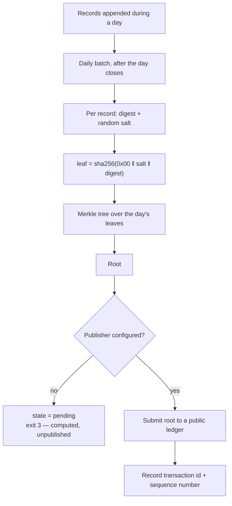

# Anchoring

!!! danger "No root has ever been published"

    Everything on this page describes a mechanism that works up to the point of
    publication and stops there. **The kernel has no tamper evidence today.**
    Nothing here should be read, quoted or diagrammed as a present-tense
    property of the system.

**What it would prevent: an operator with database credentials altering history
and nobody being able to prove it.**

[Append-only](../concepts/append-only.md) binds the *running kernel*. It does
not bind somebody with owner credentials and a `psql` prompt, because PostgreSQL
offers no way to durably revoke a right from a table's owner. Anchoring is what
would move the claim from "the application cannot" to "anyone can check".

## The mechanism



The salt matters. Without it, a leaf is `sha256(digest)` and anyone holding the
proof can test guesses about the record's contents — a small, enumerable record
space is not protected by hashing alone.

## Verification is external, or it is nothing

The dry run's verifier is a **separate process with no database access and no
kernel imports**. It fetches a proof over HTTP, recomputes the leaf, walks the
path, and compares.

```text
    2. recompute the leaf: sha256(0x00 ‖ salt ‖ record_digest)
       computed       2115b289743bc301…
       published      2115b289743bc301…
       match

    3. walk the path to a root
       computed root  f2d27546b0187b1f…

    4. NO PUBLIC ROOT FOR 2026-08-05
```

And then it says the thing that matters:

> So steps 1 to 3 proved the record is consistent with a root the kernel handed
> us in the same breath. That is not tamper evidence. A kernel that keeps its
> own root, shows you that root, and confirms your record is in it has told you
> nothing it could not have made up.

`GET /v1/anchors/roots` is the one route on the whole API that needs no subject —
the only thing an outsider can check against. It currently returns nothing for
every date.

## Exit 3

`anchor-cli` exits 3 when a root was computed but not published. Not 0, not 1.

A root computed and unpublished is genuinely neither success nor failure.
Collapsing it into 0 would report tamper evidence that does not exist;
collapsing it into 1 would page somebody for a condition that is currently
normal. `restore.sh` uses the same code for "database verified, objects
deferred".

## The publisher is an interface, not a dependency

The kernel does not take a ledger SDK as a dependency. `AnchorPublisher` is a
narrow interface — submit a root, return a transaction id — with an HTTP
implementation that POSTs to a configured endpoint.

```text
ANCHOR_PUBLISH_URL
ANCHOR_PUBLISH_AUTHORIZATION
ANCHOR_PUBLISH_TIMEOUT_MS   (default 15000)
```

The HTTP publisher is preferred over the direct one because **it is the one that
does not require this process to hold an operator private key**. ProofLayer
already does HCS anchoring and is the natural implementation; a small sidecar is
the alternative. The kernel stays dependency-free and the publisher stays
swappable.

A receipt is validated before it is recorded: a receipt with no sequence number
cannot be used to find the message on a mirror node, so accepting one would
store a claim of publication that nobody can check.

The intended network is Hedera. The maintained SDK is `@hiero-ledger/sdk`, under
Linux Foundation governance; only the import name differs from the older
`@hashgraph/sdk`. Neither is installed.

## What is missing

| | |
|---|---|
| A testnet topic | Not created. Faucet HBAR is free; this needs doing. |
| A publisher deployment | Neither ProofLayer integration nor a sidecar exists. |
| Mirror-node verification | `--verify` recomputes against the **stored** root, not against anything published. |
| Erasure interaction | An erased record's leaf hash would already be published, so the salt must be deleted as part of erasure. Erasure is unimplemented — open decision D3. |

## Freshness monitoring

```text
anchor: configured=false last_root=none age_days=- unanchored_age_days=-
        pending=1 failed=0
```

Runbook §7 covers what to do when anchoring stops. It currently opens by saying
it is not live yet, which is the honest state of that procedure.

See [0038](../decisions/index.md).
