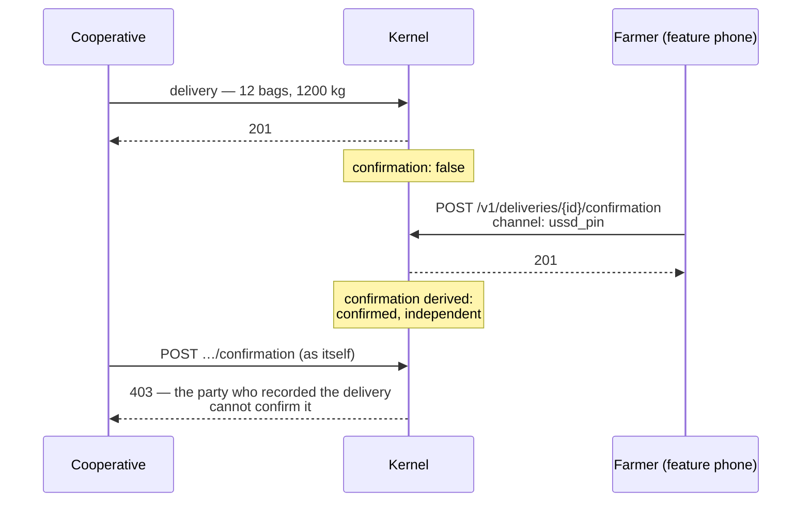

# Two-sided confirmation

**What it prevents: the party with the incentive to overstate attesting that the
other party agreed.**

This is the load-bearing change in the credit thesis, and it was until recently
wrong.

## What it was

`Delivery` carried two fields: `counterparty_confirmed_at` and
`counterparty_confirmed_by`. They were set by whoever wrote the delivery —
which, in practice, is the cooperative. So the cooperative recorded that the
farmer had agreed to the cooperative's own figure.

That is a self-attestation by the party with the incentive to overstate. It is
one-sided data wearing a two-sided name, and a lender reading
`counterparty_confirmed_at: "2026-06-28"` would reasonably believe the farmer
had said something. She had not. **That is worse than not having the field at
all**, because the absence of a field prompts a question and a filled-in field
does not.

## What it is

Confirmation is not a correction — s.8 rule 1 correctly refuses to let one party
amend another's record. It is a **distinct act by a different party**, so it gets
its own append-only record.



`counterparty_confirmed_at` is gone from the schema. The confirmation status of
a delivery is **derived** — like `Lot.custodian` and fulfilment — from records
the counterparty asserted herself.

## The rules

**Only the named counterparty may confirm.** Not any party, not the asserter.
The party who recorded the delivery cannot confirm it: *a confirmation is the
other side saying so*. Attempting it is refused, not flagged — a confirmation by
somebody who was not there is not weak evidence, it is not evidence, so there is
nothing coherent to store.

**A delegated confirmation must be labelled as such.** A delegate holding a
mandate scoped to confirmation may confirm, and the record carries
`confirmed_under_delegation`. If that mandate is the cooperative's own bylaw it
also carries `confirmed_by_organisational_bylaw` — because the cooperative is
one of the two parties to the delivery, so this is close to the seller
confirming their own record.

The derived status therefore distinguishes `confirmed` from `independent`:

| | `confirmed` | `independent` |
|---|---|---|
| Farmer confirms by USSD PIN | yes | **yes** |
| Agent confirms under her mandate | yes | no |
| Coop officer confirms under bylaw | yes | no |

The lender view prints `confirmed` or `confirmed (delegated)`, and its summary
line counts only independent confirmations. A delegated confirmation is valid
and it is not independence, and the whole point of the field is independence.

**Confirming a superseded version confirms that version.** If the weight is
later corrected, the confirmation does not carry forward; it is flagged
`confirms_superseded_version`. Otherwise a party could obtain confirmation on a
modest figure and then correct upward.

## USSD-shaped

The farmer has a feature phone and a PIN. The endpoint is built for that:

```text
POST /v1/deliveries/{id}/confirmation
{ "channel": "ussd_pin" }
```

The channel is recorded — `ussd_pin`, `in_person`, `written`, `app` — because
how somebody confirmed is part of how much the confirmation is worth.

The kernel does not run a USSD gateway. **The gateway is an adapter**: it
authenticates the farmer's handset and PIN, and calls this endpoint with her as
the verified subject. No such gateway exists yet.

`occurred_at_precision` is `instant`, not `day`. Somebody pressed a key; it is
not a day-precision fact like a harvest.

## Lawful basis is inherited

A confirmation inherits the lawful basis of the delivery it confirms. The
farmer confirming a financial record does not change what the record is, and
letting the confirmation state its own basis would open a route to launder a
`special_data_consent` record into something weaker.

## What this does not solve

It establishes that the *other side agreed to a figure*. It does not establish
that the figure is right — both parties can agree on a wrong weight, especially
when both used the same wrong scale.

What it buys is that overstating now requires two parties to collude rather than
one party to type, and that a lender can tell the difference between the two
cases. See [0039](../decisions/index.md) §7.
