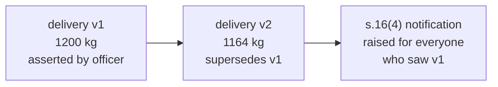
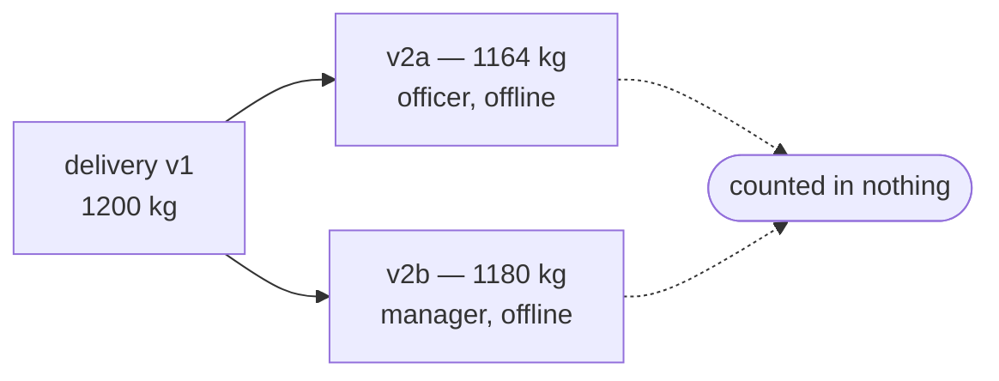

# Corrections and forks

**What it prevents: a correction that erases the thing it corrected, and an
automatic merge that invents an answer nobody gave.**

## A correction is a new record



Nothing is edited. `GET /v1/records` shows v2; `GET /v1/records/{v1}` still
returns v1; `/chain` returns both, oldest first.

A lender auditing a dispute needs to see what was claimed before it was
corrected. A system that shows only the current figure cannot distinguish a
careful correction from a convenient one, and the difference is the entire
question in a dispute.

## Correcting means telling the people who saw the old version

DPPA s.16(4) requires notifying third parties who received the superseded
version. When a correction lands, the kernel raises a notification for every
grantee that had already been disclosed the old record.

It **queues** it. It does not send it:

```text
a disclosure notification is raised for a grantee that already saw the
superseded version; it is queued, not sent, because the kernel does not
own a channel.
```

The kernel has no SMS gateway and no email sender. A system that marked the duty
discharged when it had merely written a row would be worse than one that admits
the gap — the row would look like compliance in an audit.

See [0032](../decisions/index.md).

## Who may correct

Correction rights follow from the original assertion and from delegation, not
from having write access. The rules are in [0022](../decisions/index.md).

A **fork refuses authority**: once a chain has forked, neither branch confers
the right to correct further, because it is no longer clear which record is the
one being corrected.

## Forks

Two records superseding the same parent:



This is the normal outcome of two people correcting the same record without
seeing each other's work, which offline sync makes routine rather than
exceptional.

**A forked record is counted in nothing.** Not fulfilment, not mass balance, not
a lender view, not a total anywhere. It is visible, it is flagged, and it
contributes to no figure.

The kernel does not pick a winner. Last-write-wins would resolve the dispute on
which handset reconnected first. Highest-trust-method-wins would resolve it on a
proxy that the person entering the data controls. Both would produce an answer,
and neither would produce a *correct* answer — and a wrong number that looks
settled is worse than a visible gap.

Resolution is a conversation between the two asserters, ending in a third record
that supersedes one of the branches.

See [0021](../decisions/index.md).

## Retraction is not correction

"That figure was wrong" and "that never happened" are different claims. A
retraction is its own record type; it hides a record from default reads without
removing it from the log, and it does not assert a replacement value.

## Superseded confirmations do not carry forward

If a delivery is confirmed and then corrected, the confirmation confirmed *that
version*. The corrected version is unconfirmed, and the confirmation is flagged
`confirms_superseded_version` — "the other side confirmed an earlier version;
the figure was corrected afterwards".

Anything else would let a party get a confirmation on a modest figure and then
correct upward. See [Two-sided confirmation](confirmation.md).
