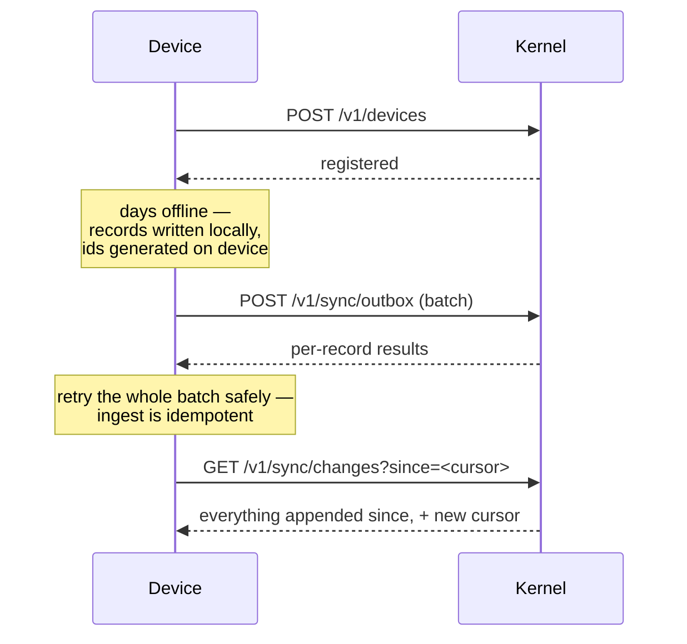

# Offline sync

**What it prevents: a design that assumes connectivity and therefore cannot be
used where the records are made.**

A collection point in rural Uganda has intermittent 2G at best. If recording a
delivery requires a round trip, deliveries get written on paper and entered
later — at which point the provenance is a person's memory and the timestamps
are fiction.

Offline is the default here, not a mode.

## Four things make it work

**Client-generated ids.** UUIDv7 on the device. Nothing needs a server round
trip to know what a record is called, and a device offline for a week collides
with nothing.

**Idempotent ingest.** The same record twice writes nothing and returns 200. A
device that lost the response to a batch can send the whole batch again without
reasoning about which parts landed.

**Batch drain.** `POST /v1/sync/outbox` takes a batch and returns a result per
record. A partial failure does not fail the batch; the device learns which
records need attention.

**Cursor pull.** `GET /v1/sync/changes?since=…` returns everything appended
since a cursor, and a new cursor.

## No server-held cursor

The kernel keeps no per-device sync state. The cursor lives on the device.

A server-held cursor sounds tidier and fails badly: it is state about a client
that the server cannot verify, cannot expire safely, and must migrate. A device
restored from backup, a reinstalled app, or two apps on one handset each produce
a case where the server's belief about the client is wrong and the client cannot
correct it.

With the cursor on the device, the worst case is that a device asks for more
than it needs and gets it. See [0008](../decisions/index.md).

## Conflicts are forks, not merges

Two field officers correct the same record while both are offline. Both
corrections arrive. Both are stored, both name the same parent, and the result
is a **fork**.

The kernel does not pick a winner. It has no basis to — last-write-wins would
resolve on which handset happened to reconnect first, which is not evidence of
anything. A forked record is counted in nothing until a human resolves it.

See [Corrections and forks](corrections.md).

## Clock skew

A handset with a wrong clock produces a record whose `occurred_at` is later than
its `recorded_at`. That is flagged `occurred_after_recorded` — a clock problem,
not necessarily a dishonest one, and the flag says so in those words.

The kernel does not correct the timestamp. It cannot know which of the two is
wrong.

## What is not built

There is no client library, no local store, and no conflict-resolution UI. The
kernel provides the endpoints and the guarantees that make an offline client
possible; the client is an application, and none exists yet.
