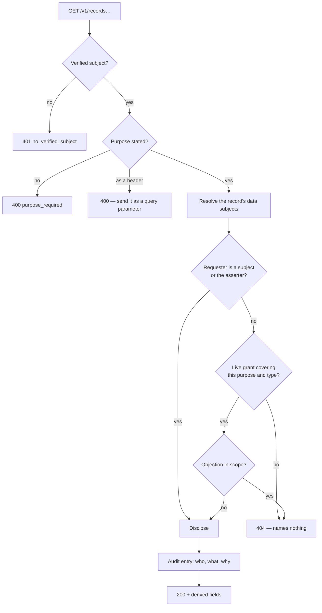

# Read path

Every read passes a consent gate, and every refusal looks identical from
outside.



## Refusals name nothing

```text
404 no such record, or not yours to read
```

No record id in the body, no type, no party id, no reason code. A 403 saying
*"no grant from party 019f… covers type delivery"* confirms that the party
exists and asserted a record — which is a disclosure to somebody who has just
been told they may not have disclosures.

The media endpoint always answered a bare 404. Records now do the same.

The reason is recorded in the audit log. A caller who believes a refusal is
wrong asks an operator, who can answer from the log; the alternative is a system
that debugs its permissions by leaking them.

Two refusals are allowed to speak, because they reveal nothing about who holds
what: `purpose_required` (400) and `no_verified_subject` (401).

## Derived on read

The stored record is not the whole answer. Computed on every read:

| Derived | From |
|---|---|
| `superseded_by` | Records naming this one in `supersedes` |
| `retracted` | Retraction records |
| `confirmation` | `delivery_confirmation` records naming this delivery |
| `Lot.custodian` | The custody transfer chain |
| Fulfilment totals | Deliveries against an obligation |
| Mass balance | The lot's inputs, outputs and declared losses |

None of these is stored, because a stored derived value can disagree with what
it was derived from and there is no `UPDATE` available to reconcile it.

## Default reads show tips

`GET /v1/records` returns the tip of every chain, with retracted records absent
and forked records **counted in nothing**.

To see history you ask for it: `GET /v1/records/{id}` returns any version
including superseded and retracted ones, and `/chain` returns every version
oldest first.

## The lender view

The one artefact a credit officer actually reads is rendered by the kernel, not
assembled by an application:

- plain text, because the reader is a person and not a parser;
- **no identifier a human does not need** — in practice no uuid appears at all,
  since a lender acts on quantities, dates and flags;
- the tolerance threshold printed, because "discrepancy" without the number it
  exceeded is an accusation with no scale;
- a glossary entry for every flag shown, and a refusal to display a flag that
  has none;
- an "as at" date, because every figure is a reading taken at a moment and a
  correction may already be in the log;
- a section for **what was refused**, so the gaps are visible rather than
  looking like absence of activity.

It is rendered through the same public API an application would use, with the
same credentials — so what a demonstration shows and what a lender gets cannot
diverge. See [0034](../decisions/index.md).

## The registry is the exception

`GET /v1/registry/**` takes no subject and passes no consent gate. It serves
data with no data subject, and it must be readable without a credential — see
[The quantity problem](../concepts/quantity.md) for why a weight you need our
permission to verify is a weight you are trusting us for.

Rows are immutable, so responses carry
`Cache-Control: public, max-age=86400, immutable`. **Cache them.** It is the
only unauthenticated surface, so it is rate limited per address — and that
counter lives in one process, which makes it per replica and no substitute for
a limit at the gateway.
