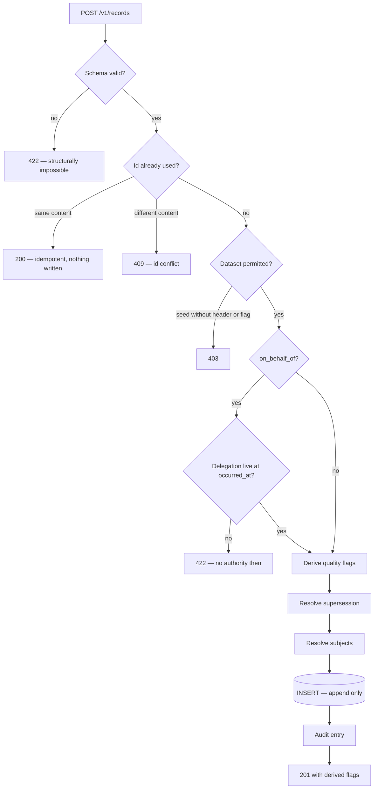

# Write path

One path. Every record of every type goes through it, and there are no branches
per entity except one, noted at the end.

## Ids come from the client

UUIDv7, generated on the device. They sort by time, so they are a reasonable
primary key, and a handset that has been offline for a week collides with
nothing.

This is what makes ingest idempotent. Submitting the same record twice returns
**200** and writes nothing. Submitting a *different* record under an id already
taken returns **409** — because silently accepting it would make the id
meaningless, and silently overwriting is not available anyway.

That distinction is what lets a device retry a batch it is not sure landed,
which is the normal condition on a bad connection.
See [0006](../decisions/index.md).

## Validation refuses very little

Only structurally impossible records are refused:

- the schema does not parse — a missing `occurred_at_precision`, an enum value
  that does not exist, `normalized_kg` with no `conversion_id`;
- the record supersedes itself;
- `on_behalf_of` without a `delegation`, or a delegation that was not live when
  the event occurred;
- a confirmation asserted by somebody who was not party to the delivery.

Everything else is stored and flagged. An implausible weight, a delivery to
oneself, a conversion that does not resolve, a lot whose components do not add
up — all of these are real things that happen, and a record refused at the door
exists only in the head of the person who was turned away.

## Cross-field rules the contract cannot express

`on_behalf_of` requires `delegation`. `normalized_kg` requires `conversion_id`.
These are Zod refinements with no JSON Schema equivalent, so they do not appear
in `openapi.json` and a generated client will not know about them until it gets
a 422.

This is a real limitation and it is listed on
[What is not yet true](../compliance/not-yet-true.md) rather than left for an
integrator to discover.

## Quality flags are derived at write, not at read

The flags are computed once, at ingest, and stored with the record. They
describe what was true of the record as submitted — recomputing them later,
against a registry that has since been corrected, would silently rewrite
history.

The full list is on the [Quality flags reference](../reference/quality-flags.md).

## The audit entry

Every append writes an audit entry. The entry holds ids and query descriptors
and **never a record body** — enforced by a type that cannot represent one, a
runtime filter, and a size cap in the database.

`kernel_app` has `INSERT` on the audit log and no `SELECT`. Reading it is a
privileged operator path, run as the owner. Entries cannot be updated or deleted
by anyone.

See [0025](../decisions/index.md).

## The one per-entity branch

`delivery_confirmation` is the single exception to "the write path does not know
about entity types". Who may assert it depends on the contents of *another*
record — the delivery it names — so ingest has to look that up.

The check refuses a confirmation whose asserter is not the named counterparty,
and flags one made under delegation. See
[Two-sided confirmation](confirmation.md).
